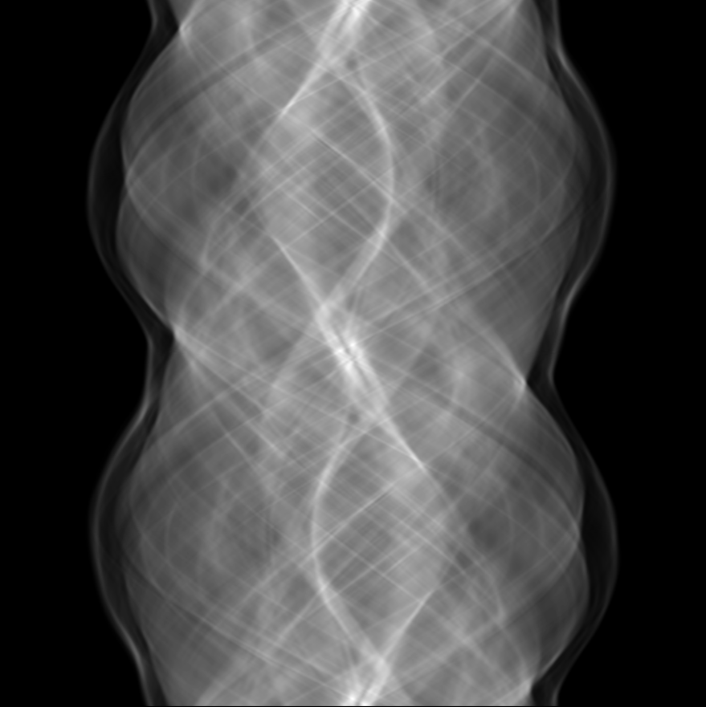

<br />
<div align="center">
  <a href="https://github.com/Poivre31/Tomographie/">
    
    
  </a>

  <h3 align="center">Méthodes numériques de tomographie</h3>

  <p align="center">
    Un projet numérique sur la reconstruction d'images acquises par tomographie !
    <br />
    <a href="https://example.com/">Voir une démo</a>
    &middot;
    <a href="https://github.com/Poivre31/Tomographie/issues/new?labels=bug&template=bug-report---.md">Signaler un bug</a>
  </p>
</div>


## À propos de la tomographie

Dans de nombreux domaines (astrophysique, géophysique et tout particulièrement l'imagerie médicale), il est impossible de mesurer de manière directe une grandeur à l'intérieur d'un objet. Soit parce que cet objet est trop éloigné (astrophysique), soit parce qu'on ne peut pas creuser son intérieur (géophysique), ou encore parce qu'on pourrait le faire... mais qu'on préfère l'éviter ! (médical).

Dans ce contexte, la tomographie permet de reconstruire l'intérieur de cet objet à partir de mesures effectuées depuis l'extérieur. Par exemple, les géophysiciens ont accès aux données sismologiques, qui sont directement influencées par la structure de la Terre. Dans le domaine médical, plusieurs méthodes d'imagerie (scanners à rayons X) permettent de mesurer des projections à travers l'organisme. L'enjeu est alors de reconstruire l'intérieur de l'objet à partir de ces mesures. C'est un problème inverse complexe qui suscite l'intérêt de nombreux chercheurs. L'un des résultats fondamentaux en tomographie est le **théorème de la tranche centrale de Fourier**, qui relie le sinogramme (l'ensemble des projections mesurées) à l'objet initial via la transformation de Fourier.

Le but de ce projet est, dans un premier temps, de simuler les données obtenues par un appareil tomographique. Ici, la projection pour un couple (angle, distance) donné — c'est-à-dire l'intégrale de la densité de l'objet selon le rayon associé — est calculée par la méthode des rectangles à pas variables. Les intersections du rayon avec la grille de pixels permettent de déterminer ces différents pas. Il est également possible d'affiner la simulation des données en y ajoutant différents types de bruits. 

Ensuite, l'image est reconstruite à partir du théorème de la tranche centrale :
* La transformée de Fourier de chaque projection (l'ensemble des intégrales à toutes les distances mesurées pour un angle fixé) est calculée.
* Ces données polaires sont interpolées sur une grille cartésienne à l'aide d'une interpolation bilinéaire, fournissant ainsi la transformée de Fourier 2D de l'image.
* L'image finale est reconstruite par transformée de Fourier inverse.

Cette méthode présente un défi d'interpolation particulièrement intéressant et offre de meilleures performances que son alternative directe, la rétroprojection filtrée, raison pour laquelle elle a été privilégiée ici. Néanmoins, c'est cette dernière qui reste la plus couramment utilisée dans l'industrie, notamment pour s'affranchir de ces problématiques d'interpolation.

Lorsque le nombre de projections est insuffisant (ce qui arrive fréquemment en raison des contraintes réelles), la reconstruction dans le domaine de Fourier est incomplète. Cela entraîne l'apparition d'artefacts de reconstruction dans le domaine spatial. Plusieurs méthodes permettent d'atténuer ce défaut, comme le filtrage par une fenêtre de Shepp-Logan ou de Hann, ainsi que l'acquisition compressée (*compressed sensing*). Cette dernière approche est au cœur des avancées récentes du domaine et sera implémentée prochainement.

Ce projet est accompagné d'un rapport détaillé disponible [ici](resources/rapport_imagerie.pdf)

## Utiliser le projet

Voici les instructions à suivre pour installer et utiliser le projet.

### Dépendances

* Le projet a été développé sous Linux, qui est requis pour le moment. Bien qu'il puisse être compilé/lié sous Windows, les scripts d'exécution sont écrits pour un système Linux.
* **CMake 3.23** ou supérieur est requis pour compiler le projet.
* **Python 3.x** est nécessaire. Pour l'importation et l'affichage des images, les bibliothèques `matplotlib`, `numpy` et `PIL` (Pillow) doivent être installées sur votre environnement Python. Si ce n'est pas le cas :
```sh
sudo apt install python3-matplotlib
sudo apt install python3-numpy
sudo apt install python3-pillow
```

### Installation
Il suffit de cloner le répertoire:
 ```sh
 git clone https://github.com/Poivre31/Tomographie.git
 ```
puis de se réferer à `Utilisation` pour compiler le projet et exécuter le programme.

### Utilisation

Le dossier `run` contient plusieurs scripts permettant d'effectuer diverses tâches, telles que compiler le projet, calculer uniquement le sinogramme ou lancer la reconstruction complète d'une seule traite.

L'image à étudier ainsi que les paramètres de calcul sont à définir dans le fichier config.txt, qui peut être directement édité à l'aide du script configure.sh. Il est possible de renseigner shepp-logan, rectangle ou ellipse pour utiliser les formes par défaut, ou d'indiquer le nom d'une image PNG située dans le dossier resources pour l'utiliser comme référence (par exemple : brain.png).

Les exécutions suivantes du programme utiliseront alors ces paramètres.

Pour exécuter l'un des scripts, il faut d'abord lui donner les droits d'exécution. Depuis le dossier principal :
```sh
chmod -R 755 run
```
Puis simplement executer le script depuis le dossier run. Par exemple, pour compiler puis calculer le sinograme et la reconstruction:
```
cd run
./build_and_run.sh
```


## Roadmap

- [x] Améliorer la qualité de l'algorithme de reconstruction
- [ ] Améliorer les performances de l'algorithme de projection
- [ ] Ajouter une interface utilisateur
- [ ] Utiliser l'accéleration GPU
- [ ] Expérimenter avec la détection compressée
    - [ ] Décomposition en ondelettes
    - [ ] Alogithme de Basis Pursuit Denoising
- [ ] Support des systèmes
    - [x] Linux
    - [/] Windows
- [ ] Support des langues
    - [/] English
    - [/] Francais

Les tickets ouverts sont disponibles ici [open issues](https://github.com/Poivre31/Tomographie/issues).

## License

Distribué selon la GNU General Public License. Voir `LICENSE.txt` pour plus de détails.

## Contact

Raphaël Boisard - raphael.boisard@utoulouse.fr

<p align="right">(<a href="#readme-top">back to top</a>)</p>
