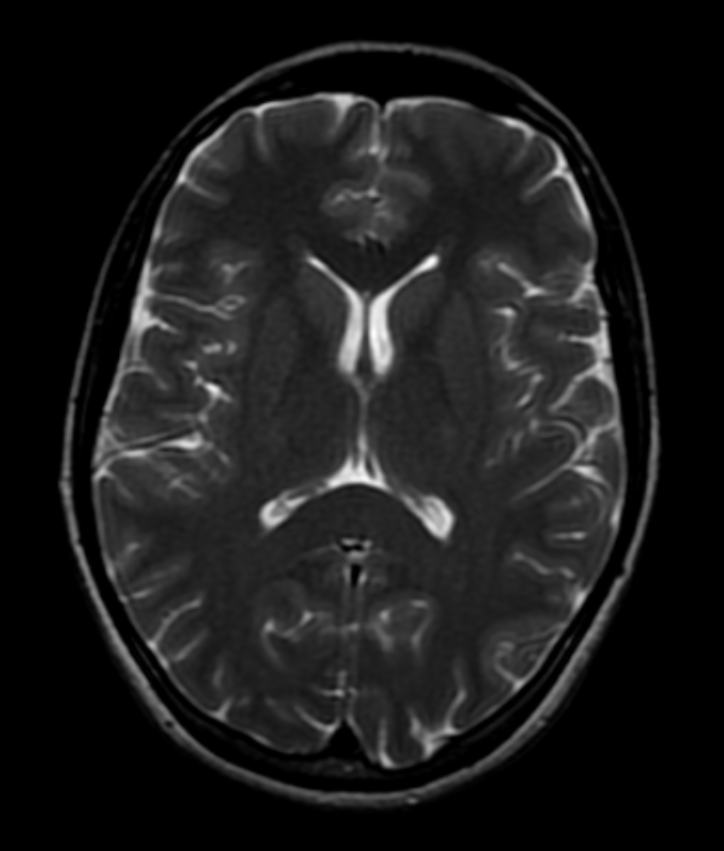

<!-- PROJECT LOGO -->
<br />
<div align="center">
  <a href="https://github.com/Poivre31/Tomographie/">
    
  </a>

  <h3 align="center">Tomographie</h3>

  <p align="center">
    Un projet numérique sur la reconstruction d'image acquises par tomographie!
    <br />
    <a href="https://example.com/">Voir une démo</a>
    &middot;
    <a href="https://github.com/Poivre31/Tomographie/issues/new?labels=bug&template=bug-report---.md">Déclarer un bug</a>
  </p>
</div>


<!-- ABOUT THE PROJECT -->
## About The Project

[![Product Name Screen Shot][product-screenshot]](https://example.com)

Dans de nombreux domaines (astrophysique, géophysique et tout particulièrement l'imagerie médicale), il est impossible de mesurer de manière directe une grandeur à l'intérieur d'un objet. Soit parce que cet objet est trop loin (astro), qu'on ne peut pas creuser son intérieur (géo) ou qu'on peut le faire... mais qu'on ne préfère pas ! (médical)
Dans ce contexte, la tomographie permet de reconstruire l'intérieur de cet objet à partir de mesures effectuées depuis son extérieur. Par exemple, les géophysiciens ont accès aux données séismologies, influencées directement par la structure de la Terre. Dans le domaine médical, plusieurs méthodes d'imagerie (IRM, les scanner à rayon X) permettent de mesurer des projections à travers l'objet. L'enjeu est alors de reconstruire l'intérieur de l'objet à partir de ces mesures. C'est un problème inverse difficile qui a attiré l'attention de beaucoup de chercheurs. 

## Getting Started

Voici les instructions à suivre pour installer et utilsier le projet.

### Dépendances

* Le projet est construit sous Linux qui est pour le moment nécessaire. Il peut en effet être compilé/linké sous Windows mais les script d'éxecution sont écrits pour un système Linux.
* Python 3.xx est nécessaire. Pour l'import et l'affichage des images, il faut de plus que les librairies `matplotlib`,`numpy` et `PIL`soient installées pour cette installation python. Si ce n'est pas le cas:
```sh
    sudo apt install python3-matplotlib
    sudo apt install python3-numpy
    sudo apt install python3-pillow
```

### Installation

_Below is an example of how you can instruct your audience on installing and setting up your app. This template doesn't rely on any external dependencies or services._

1. Get a free API Key at [https://example.com](https://example.com)
2. Clone the repo
   ```sh
   git clone https://github.com/github_username/repo_name.git
   ```
3. Install NPM packages
   ```sh
   npm install
   ```
4. Enter your API in `config.js`
   ```js
   const API_KEY = 'ENTER YOUR API';
   ```
5. Change git remote url to avoid accidental pushes to base project
   ```sh
   git remote set-url origin github_username/repo_name
   git remote -v # confirm the changes
   ```

<p align="right">(<a href="#readme-top">back to top</a>)</p>


<!-- USAGE EXAMPLES -->
## Usage

Use this space to show useful examples of how a project can be used. Additional screenshots, code examples and demos work well in this space. You may also link to more resources.

_For more examples, please refer to the [Documentation](https://example.com)_


## Roadmap

- [x] Améliorer la qualité de l'algorithme de reconstruction
- [ ] Améliorer les performances de l'algorithme de projection
- [ ] Ajouter une interface utilisateur
- [ ] Utiliser l'accéleration GPU
- [ ] Expérimenter avec la détection compressée
    - [ ] Décomposition en ondelettes
    - [ ] Alogithme de Basis Pursuit Denoising
- [ ] Support des systèmes
    - [x] Linux
    - [/] Windows
- [ ] Support des langues
    - [/] English
    - [/] Francais

Les problèmes ouverts sont disponibles ici [open issues](https://github.com/Poivre31/Tomographie/issues).


## License

Distributed under the GNU General Public License. See `LICENSE.txt` for more information.

<p align="right">(<a href="#readme-top">back to top</a>)</p>


## Contact

Raphaël Boisard - raphael.boisard@utoulouse.fr

## Acknowledgments

Use this space to list resources you find helpful and would like to give credit to. I've included a few of my favorites to kick things off!

* [Choose an Open Source License](https://choosealicense.com)
* [GitHub Emoji Cheat Sheet](https://www.webpagefx.com/tools/emoji-cheat-sheet)
* [Malven's Flexbox Cheatsheet](https://flexbox.malven.co/)
* [Malven's Grid Cheatsheet](https://grid.malven.co/)
* [Img Shields](https://shields.io)
* [GitHub Pages](https://pages.github.com)
* [Font Awesome](https://fontawesome.com)
* [React Icons](https://react-icons.github.io/react-icons/search)

<p align="right">(<a href="#readme-top">back to top</a>)</p>
